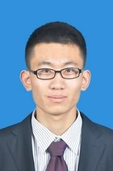

[Email](mailto:wwj12110303@i.smu.edu.cn)  /  [Resume](./CV_WWJ/1_Curriculum_Vitae_20250228.pdf)  /  [Google Scholar](https://scholar.google.com/citations?user=j8PmNI4AAAAJ&hl=en)  /  [Github](https://github.com/WangjiangWu)

## Biography
**I am currently a PhD student. My research is about the tri-contrast imaging by using cold-cathode flat-panel X-ray source (FPXS).**

## Education
- Ph. D. in Department of Biomedical Engineering, [Southern Medical University](https://en.wikipedia.org/wiki/Southern_Medical_University), Guangzhou. Supervisor: [Prof. Linghong Zhou](https://portal.smu.edu.cn/swyxgcxy/info/1021/1283.htm) and [Dr. Yuan Xu](https://portal.smu.edu.cn/swyxgcxy/info/1021/2625.htm). (Sep. 2021 - June 2025)
- M. S. in Department of Biomedical Engineering, [Capital Medical University](https://en.wikipedia.org/wiki/Capital_Medical_University), Beijing. Supervisor: [Prof. Zhi Yang](http://ccmu.teacher.360eol.com/teacherBasic/preview?teacherId=11459). (Sep. 2016 - June 2019)
- B. S. in Department of Biomedical Engineering, [Capital Medical University](https://en.wikipedia.org/wiki/Capital_Medical_University), Beijing. (Sep. 2012 - June 2016)

## Work Experience
- Medical Physicist, Department of Radiation Oncology, [Peking University Third Hospital](https://en.wikipedia.org/wiki/Peking_University_Third_Hospital). (Aug. 2019 - Aug. 2021)

## Selected Publications (First or Corresponding authors)
**Full publication list can be found in my CV, Google Scholar page, or Research Gate.**
1. **Wu, Wangjiang**, et al. "Reconstruction of Cold-Cathode Flat-Panel X-ray Source distribution by Coded Aperture Imaging." IEEE Transactions on Medical Imaging. (Under Review)
2. Xiaoying Zhang, Jiancong Dai, Jun Chen\#, **Wangjiang Wu\#**, and Yuan Xu\#, "Characteristic Analysis of Anode Panel for ZnO Nanowires Cold Cathode Flat-Panel X-ray Source Using Monte Carlo Simulation", Nuclear Science and Techniques, (2024) (*\# co-corresponding author*).
3. **Wu, Wangjiang**, et al. ["Feasibility Study of a Cold-cathode Flat-panel X-ray Source with Micro-array Anode Target for Grating Interferometer Computed Tomography."](https://ieeexplore.ieee.org/document/10296928) IEEE Transactions on Nuclear Science (2023).
4. **Wu, Wangjiang**, et al. ["Multiresolution residual deep neural network for improving pelvic CBCT image quality."](https://aapm.onlinelibrary.wiley.com/doi/abs/10.1002/mp.15460) Medical Physics 49.3 (2022): 1522-1534.

## Conference (First or Corresponding authors)
1. **Wangjiang Wu**, et al. "Performance of a Coherent Cold-Cathode Flat-Panel X-Ray Source and Grating Effective Thickness Calculation for Grating-Based Phase Contrast Imaging", AAPM 2024. (*General poster discussion*)
2. Guocong Shao, Qing Li, Zengxiang Pan, Xiaoye Chen, Xiaoying Zhang, Qi Liu, Guicai Qi, Jun Chen, **Wangjiang Wu\#**, Yuan Xu\#，Linghong Zhou\#. ["Source Phase Stepping for grating interferometry using Addressable Cold-Cathode Flat-Panel X-ray Source"](https://aapm.onlinelibrary.wiley.com/doi/abs/10.1002/mp.15460), XNPIG 2024. (*Oral Presentation, Corresponding Author*)
3. **Wangjiang Wu**, et al. "Simulation study of a novel ZnO nanowire cold cathode flat-panel x-ray source using EGSnrc for Talbot-Lau type grating interferometry." Medical Imaging 2023: Physics of Medical Imaging. Vol. 12463. SPIE, 2023. (*Oral Presentation + Paper*)
4. **Wangjiang Wu**, et al. "Multi-Resolution Residual Deep Neural Network for Generating Synthetic CT Images with High HU Accuracy and Structural Fidelity", AAPM 2021 Virtual 63rd Annual Meeting. (*Oral Presentation*)

